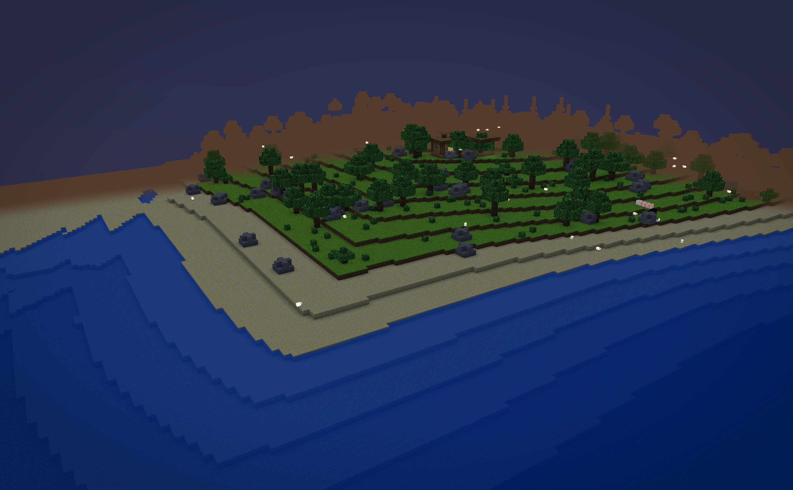
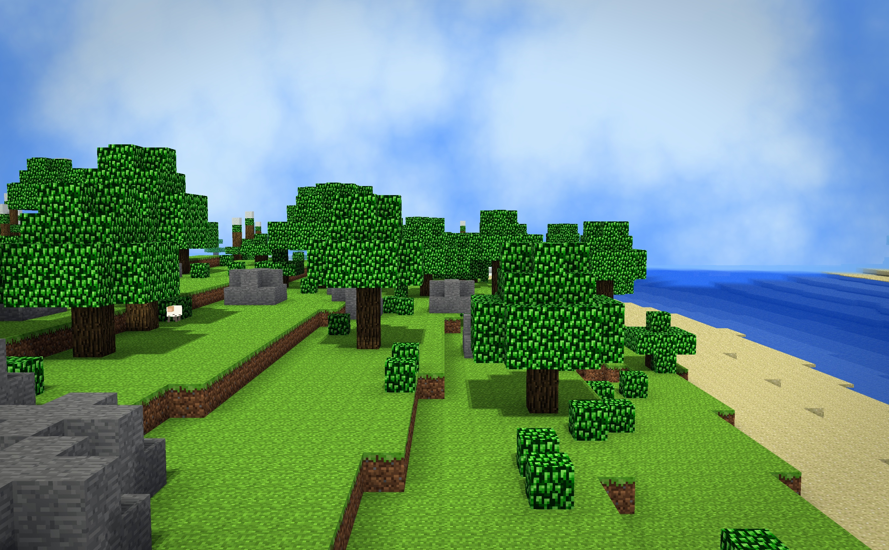
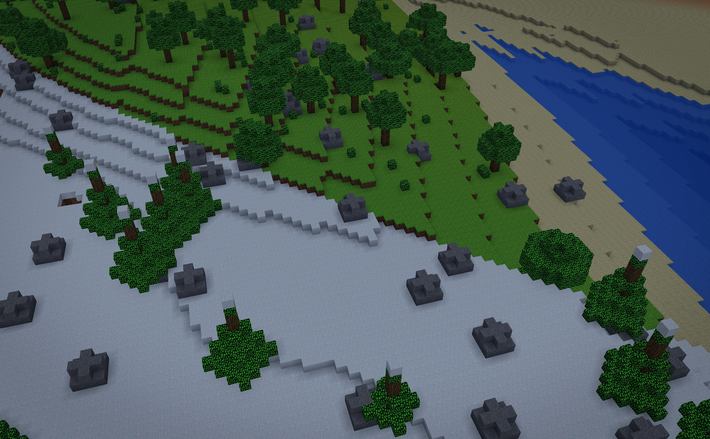
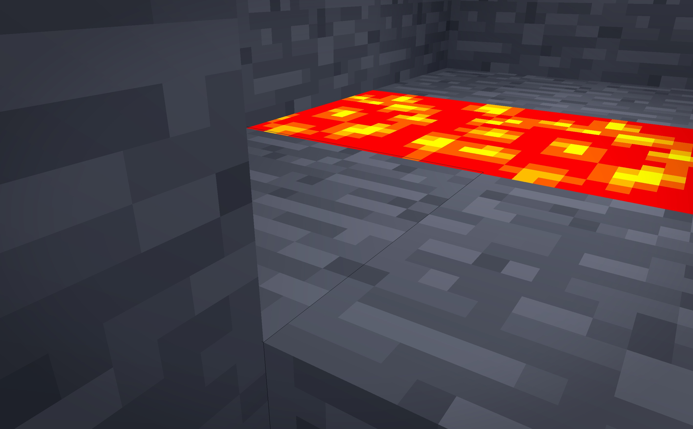
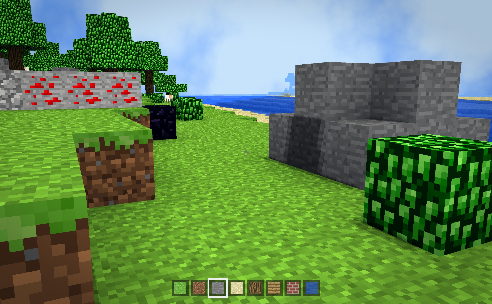
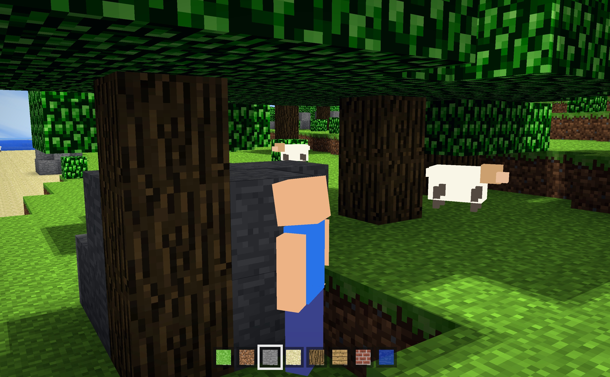
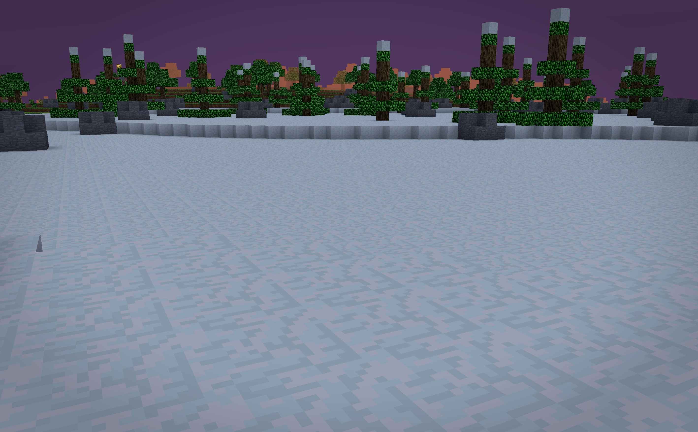

# Mini Minecraft

A 3D voxel world engine in the style of Minecraft, built with C++17, Qt 6, and
OpenGL for UPenn's CIS 4600/5600 final project. The world generates
procedurally and effectively endlessly as you explore it, with four biomes,
cave systems, lakes, weather, a day and night cycle, and wandering sheep.



|  |  |
|---|---|
|  |  |
|  |  |

## Features

### Milestone 1: engine foundations

- **Procedural terrain** from hand rolled noise: Perlin (2D and 3D), fractal
  Brownian motion, and Worley/Voronoi (`src/biomegenerator.h`). Terrain height
  blends smoothly between biomes.
- **Efficient chunked rendering.** The world is built from 16x256x16 chunks
  meshed into interleaved per chunk VBOs (position, normal, color, UV). Faces
  are emitted only on filled/empty boundaries, including across chunk borders.
- **Player physics:** walking, Minecraft creative style colliding flight, and
  a collision free noclip flight (the spec's flight mode). Movement uses drag
  and acceleration, gravity, jumping, and grid marched swept collision along
  each axis so the player slides along walls (`src/scene/player.cpp`). The only
  ways underground are digging or walking into a cave entrance.
- **Block interaction.** Left click removes the block under the crosshair
  (within reach), right click places a copy of the hit block one cell in front
  of it. Bedrock cannot be broken.

### Milestone 2: detail and performance

- **Caves** carved by 3D Perlin noise beneath the surface, with lava pools
  flooding everything below y=25 and an unbreakable bedrock floor at y=0.
- **Texturing and animation:** classic texture atlas UVs per block face, time
  animated scrolling water and lava, and alpha blended water rendered in a
  separate transparent pass after all opaque geometry.
- **Post process overlays.** The scene renders into an offscreen framebuffer
  and composites through a post shader: a wavy blue tint with caustic light
  rays underwater, and a pulsing heat distorted red tint in lava
  (`glsl/post.frag.glsl`, `src/scene/framebuffer.cpp`).
- **Swimming.** Water and lava do not block movement. The player moves at
  two thirds speed in liquid and swims upward at a constant rate while holding
  Space.
- **Multithreaded terrain streaming.** Every tick the engine scans the window
  of terrain generation zones around the player. BlockTypeWorker tasks fill new
  zones' block data and VBOWorker tasks mesh chunks on a worker pool. The main
  thread instantiates chunks, hands out work, and uploads finished VBOs a few
  per frame, so exploration never hitches. Shared state is confined to mutex
  guarded queues plus per chunk atomic flags (`src/scene/terrain.cpp`).

### Milestone 3: extras

- **Minecraft style lighting engine.** Sunlight flood fills the world with
  light levels from 0 to 15 (BFS propagation through a chunk neighborhood per
  mesh), streaming through cave entrances and dimming through water and leaves.
  Lava is a light emitter that makes caverns glow. Light is sampled per vertex
  with smooth interpolation and classic ambient occlusion, giving terrain its
  soft cornered Minecraft look (`src/scene/chunk.cpp`).
- **Walk in cave entrances.** The strongest cave tunnels breach hillsides, so
  caves can be explored from the surface. Daylight fades as you descend, guided
  by a soft held torch glow around the player.
- **Four biomes:** grassland, mountains, desert, and snowfield, chosen by low
  frequency temperature, moisture, and elevation noise with smooth height
  blending at every border. Beaches form along lake and ocean shores.
- **Lakes and rivers.** Water fills valleys up to sea level, and an L system
  expands `F -> F[+F]F[-F]` per region into branching polylines that carve
  smooth banked, winding river channels.
- **Distinct vegetation per biome** (`src/scene/vegetation.cpp`): broad rounded
  oaks with occasional canopy giants and low bushes in the grasslands, and tall
  snow capped conifers in the snowfields, so each biome's forests read at a
  glance. Leaf tuft shrubs sprinkle the meadow floor for ground detail. Trees
  are placed deterministically from a hash of position, so canopies span chunk
  borders seamlessly.
- **Biome matched landmarks.** Every biome grows its own family of
  deterministic builds, placed about one per region so exploration keeps
  turning up something new (`src/scene/structures.cpp`):
  - Grassland and snowfield: shape grammar plank and log towers, standing stone
    monuments (a tapered obelisk ringed by capped pillars on a dais), cottage
    villages clustered around a stone well, and weathered ruins of an old hall
    with toppled columns and a surviving archway.
  - Mountains: battlemented brick watchtowers with a lit beacon.
  - Desert: sandstone pyramids with a burial chamber and corridor, or half
    buried ruins.
  - Monuments, watchtowers, villages, and ruins carry glowing beacons and
    torches that the lighting engine picks up, so landmarks read at a distance.
- **Scattered boulders:** small rounded rock outcrops with a coal seam dot the
  grassland and snowfields, giving the terrain rocky, natural detail.
- **Ore veins.** Coal, iron, gold, and diamond clumps are seeded through the
  stone by depth gated 3D noise, coal high and diamond only near bedrock,
  matching Minecraft's distribution.
- **Day and night cycle:** a ray marched procedural sky with keyframed zenith,
  horizon, and sun colors, a moving sun, and terrain lighting that follows the
  sky (`src/skyrenderer.cpp`, `glsl/sky.frag.glsl`).
- **Weather:** rain and snow particle systems with wind, sky dimming, and
  weather dependent fog (`src/weathersystem.cpp`). The sky stays clear during
  calm play and only changes on the Z, X, and C keys, so no unbidden particles
  drift through a quiet scene.
- **Shadow mapping.** The sun renders the world's depth into a 2048px buffer
  every frame and the terrain shader PCF tests against it, so trees, towers,
  and hills cast real moving shadows (`glsl/shadow.*`, `DepthFrameBuffer`).
- **Cinematic color grade.** A final post pass applies a gentle filmic contrast
  curve, a touch more saturation, a warm highlight and cool shadow split tone,
  and a soft vignette, lifting the whole scene from flat to polished
  (`glsl/post.frag.glsl`).
- **Distance fog** fades terrain into the sky's horizon color at the draw edge.
- **Procedural grass color.** The grey grass tile is tinted per vertex from a
  world scale climate field, blending lush and dry greens smoothly across
  biomes (the classic Minecraft colormap trick).
- **Water waves.** Water vertices ride a world position based wave in the
  vertex shader, with matching surface normals and a Blinn-Phong sun glint.
- **Frustum culling.** Chunks whose bounding boxes fall outside the view
  frustum (Gribb-Hartmann plane extraction) are skipped each pass.
- **Sheep NPCs** with wandering AI: random walks, turns, pauses, obstacle
  jumping, water avoidance, and an occasional bleat (`src/scene/sheep.cpp`).
- **Inventory and crafting (B).** Breaking a block collects it, placing
  consumes it (water is infinite), and per slot counts render on the hotbar as
  seven segment digits. The crafting menu lists six recipes (planks from wood,
  bricks from stone, torches, redstone wire, levers, and lamps) with ingredient
  counts shown green when affordable and red when not (`src/scene/hud.cpp`).
- **Redstone circuits.** Wire, torches, levers, and lamps are placeable blocks.
  A BFS power solver re runs on every edit: torches and switched on levers emit
  power 15, wire carries it with one per block decay, and lamps light up (with
  real emitted light) when powered. Right click a lever to flip it
  (`src/scene/terrain_systems.cpp`).
- **Fluid flow.** Placed or released water and lava spread step by step, down
  first and then outward (water reaches farther than lava), so breaking a
  lakeside wall visibly floods the gap.
- **Buoyant lava.** The player can never be pulled under lava. Buoyancy keeps
  them bobbing on its surface, which reads far better than a red tinted dive.
- **Swim out lunge.** Stroking toward a one block bank while swimming boosts the
  player over its lip, exactly like Minecraft's water climb, so rivers and lakes
  are always exitable.
- **Third person mode (V).** The camera pulls back behind an animated blocky
  avatar whose legs swing while walking and whose arm swings when breaking or
  placing.
- **Rain and snow lens splats.** Droplets refract the scene and snowflakes splat
  softly on the screen while a storm runs.
- **Height map import (H).** Any image reshapes the terrain around the player:
  brightness sets column height and pixel color picks the block.
- **OBJ voxelization (J).** Loads a mesh, point samples its surface, and stamps
  it into the world in stone.

## Controls

Click the window to capture the mouse and play, and press **Esc** to release
the mouse (press it again to quit). A crosshair appears while playing, and the
block it targets is outlined.

| Input | Action |
|---|---|
| W / A / S / D | Move (horizontal in ground mode) |
| Mouse | Look around (pitch clamped at straight up and down) |
| F | Toggle flight and walking (flight collides, like Minecraft creative) |
| G | Toggle noclip flight (collision free, phases through terrain) |
| E / Q | Fly up and down (flight mode only) |
| Space | Jump on the ground, or hold to swim up in water |
| Shift | Sprint |
| Left / right click | Break and place block (bedrock is unbreakable) |
| R | Extend reach by 1 block (3 up to 10) |
| 1 to 8 | Select the hotbar block to place |
| Tab | Flip the hotbar between building and redstone pages |
| B | Open and close the crafting menu (arrows browse, Enter crafts) |
| T / Y / U / I | Set time to morning, noon, sunset, or midnight |
| Z / X / C | Set weather to clear, rain, or snow |
| V | Toggle third person view |
| H | Import an image as a height map |
| J | Voxelize an OBJ mesh into the world |
| Arrow keys | Rotate the camera |
| P | Save a screenshot to the Desktop |
| O | Toggle the debug world axes |

## Design notes versus the assignment text

Everything in the three milestone specs is implemented. Three details are
deliberately tuned for a more authentic Minecraft feel:

- **Flight.** The game starts on foot like Minecraft survival (the spec starts
  airborne). Press F to fly. The spec's collision free flight mode exists as the
  noclip toggle (G), while default F flight collides with terrain like Minecraft
  creative, so the only ways underground in normal play are digging or cave
  entrances. Vertical flight (E and Q) moves along the world up axis regardless
  of look pitch.
- **Collision volume.** Still two blocks tall with per axis grid marched sweeps,
  but 0.6 blocks wide like Minecraft's real player box, which the classic dig
  straight down loop requires.
- **Cave density.** The spec's rule of carving wherever 3D Perlin is negative
  hollows out roughly half the underground into one giant cavern. The threshold
  here sits in the noise's low tail instead, which yields winding Minecraft like
  tunnel networks (roomier with depth, lava pools below y=25, bedrock floor, all
  per the spec).

## Building and running

Requires Qt 6 (`core widgets openglwidgets multimedia`) and a C++17 compiler.
There are no other dependencies, since GLM is vendored in `src_package/include`.

**Qt Creator:** open `src_package/miniMinecraft.pro`, configure with any Qt 6
kit, then build and run.

**Command line** (macOS example with Homebrew Qt):

```sh
mkdir build && cd build
qmake ../src_package/miniMinecraft.pro
make -j8
./MiniMinecraft.app/Contents/MacOS/MiniMinecraft
```

### Developer utilities

Behavior is driven by environment variables, handy for headless verification
and for framing demo shots:

- `MC_SPAWN="x,y,z[,pitch[,yaw]]"` overrides the spawn pose.
- `MC_TIME="hours"` pins the starting time of day (for example `MC_TIME=12`).
- `MC_TP=1` starts in third person view.
- `MC_AUTOSHOT=1` saves a frame grab to `/tmp/mc_frame_N.png` every few seconds
  and logs average frame times. It works even while unfocused.
- `MC_PILOT=1` runs the scripted end to end self test: every movement key in
  both modes, sprint and jump, pitch clamping, block breaking and placing, reach
  extension, all time and weather settings, swimming, sheep AI, underground
  movement, digging a shaft straight down, pillaring back up, crafting,
  redstone, and inventory collection. It logs `TEST <name>: PASS/FAIL` per check
  and saves a frame per stage to `/tmp/mcp_*.png`.
- `MC_DEMO=1` plays the continuous cinematic feature tour (eased camera, no
  teleports) used to record the demo video.
- `MC_SHOTS=<dir>` plays the demo and saves a full resolution PNG at a set of
  curated moments (with the HUD shown or hidden per shot), then quits. Used to
  capture the portfolio screenshots.
- `MC_RECORD=<dir>` saves every rendered frame as a JPEG into `<dir>` on worker
  threads, plus a `times.txt` timestamp index, for assembling video with ffmpeg.
- `MC_FIXEDSTEP=1` advances the simulation exactly 1/30s per tick regardless of
  wall time, so a recorded frame sequence plays back as flawless 30fps video
  even on a loaded machine.
- `MC_WINSIZE=WxH` overrides the window size (for example `MC_WINSIZE=1440x900`).

## Architecture

```
src_package/
  miniMinecraft.pro      qmake project
  glsl/                  lambert, flat, sky, weather, post, shadow, hud shaders
  textures/              block atlas and weather sprites
  src/
    mygl.{h,cpp}         game loop and render passes
    mygl_render.cpp      sky, terrain, HUD, and post passes
    mygl_input.cpp       keyboard and mouse handling
    pilot.cpp, shots.cpp scripted self test, demo, and screenshot tours
    importers.cpp        height map and OBJ voxelization
    biomegenerator.h     noise library and biome, height, cave, tree functions
    skyrenderer.*        day and night sky dome
    weathersystem.*      rain and snow particles
    shaderprogram.*      shader wrapper (separate and interleaved draws)
    scene/
      terrain.*          chunk map, worker pool, streaming pipeline, draw
      terrain_gen.cpp    terrain fill, trees, structures
      terrain_systems.cpp fluids, redstone, bulk edits
      chunk.*            block storage, face culled mesher, GPU buffers
      chunk_light.cpp    per vertex light and ambient occlusion
      structures.cpp     towers, monuments, villages, ruins, pyramids
      vegetation.cpp     biome specific trees, bushes, boulders
      player.*           input processing, physics, block picking
      sheep.*            sheep AI and audio
      hud.*              hotbar, crafting menu, seven segment counts
      blockhighlight.*   targeted block outline
      framebuffer.*      offscreen render target for post processing
      quad.*             fullscreen post process quad
```

Rendering each frame proceeds as sky, opaque terrain, sheep, transparent
terrain, then weather particles, all into the offscreen framebuffer, followed
by one post process pass onto the screen.

## Team

Originally developed as a three person course project. This repository contains
the combined implementation with subsequent bug fixes and the milestone 3
feature set listed above.
